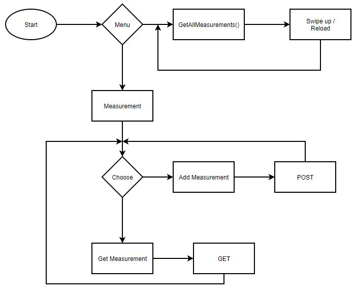
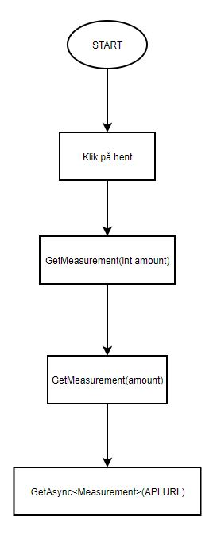
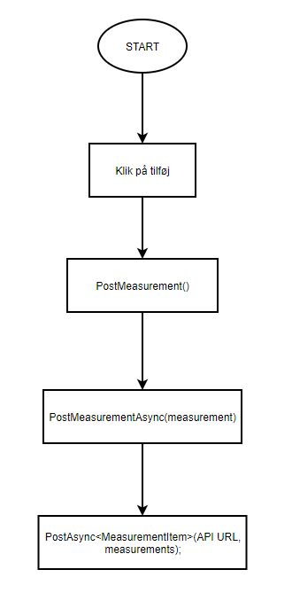
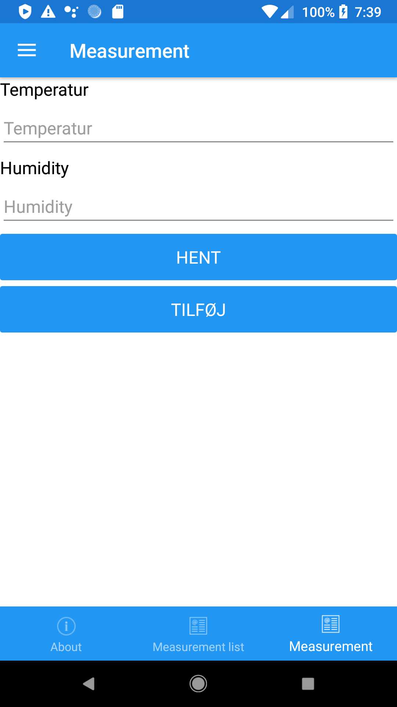
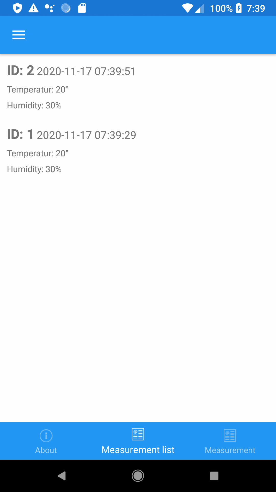
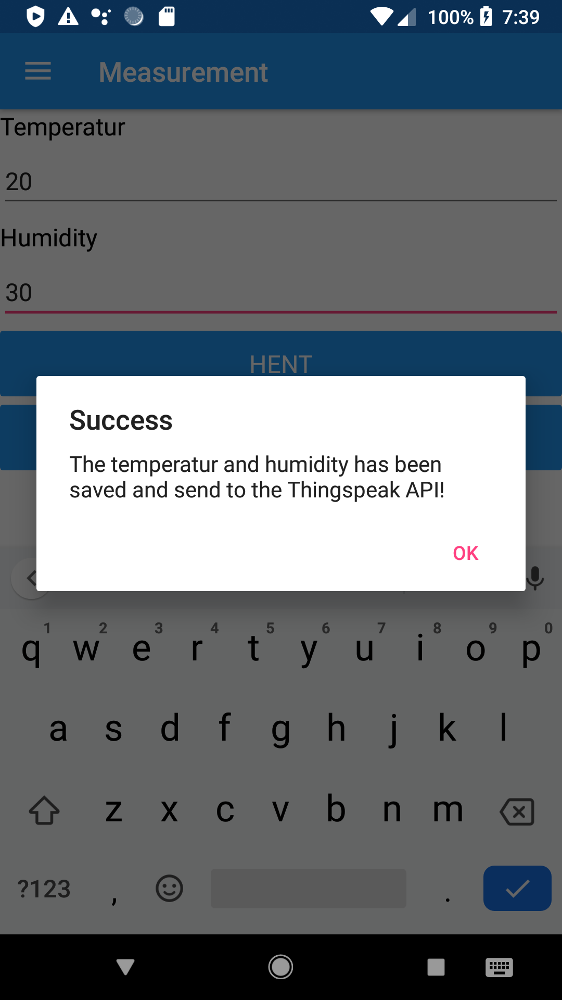
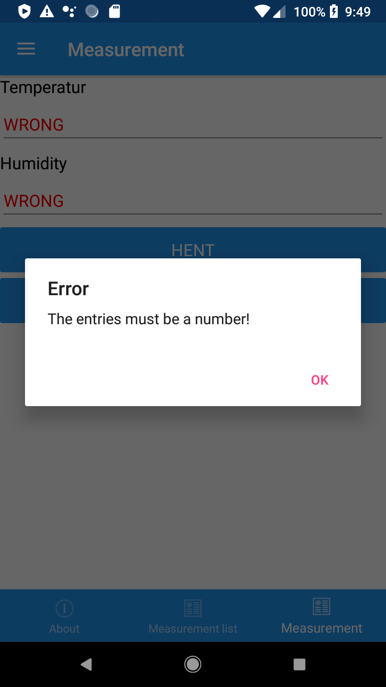
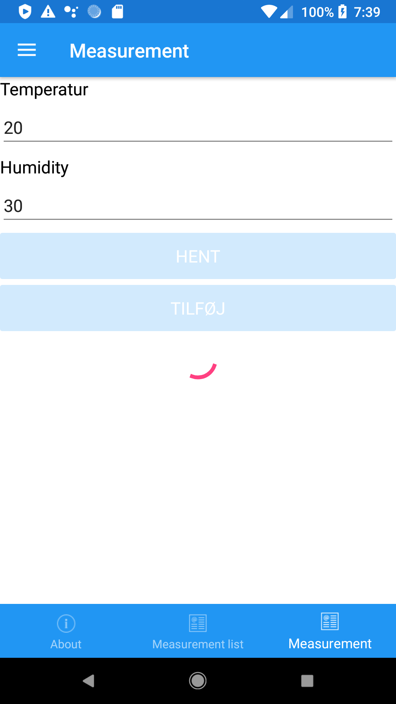
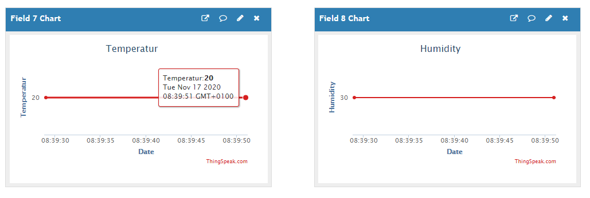

# App programmering 3 projekt - Kenneth Jessen

<h3>Indholsfortegnelse</h3>

1. <b>[Krav](#1-Krav)</b>
2. <b>[Indledning](#2-Indledning)</b>
    - [Features](#2-1-Features)
    - [Andre Features](#2-2-AndreFeatures)
    - [Flowchart](#2-3-Flowchart)
3. <b>[MeasurementPage](#3-MeasurementPage)</b>
    - [Filer](#3-1-Filer)
    - [Messaging Center](#3-2-MessagingCenter)
    - [Commands](#3-3-Commands)
    - [GetMeasurement](#3-4-GetMeasurement)
    - [PostMeasurement](#3-5-PostMeasurement)
4. <b>[MeasurementListPage](#4-MeasurementListPage)</b>
    - [Command](#4-1-Command)
    - [ExecuteLoadMeasurements](#4-2-ExecuteLoadMeasurements)
5. <b>[Behavior](#5-Behavior)</b>
    - [Attach / Detach](#5-1-AttachAndDetach)
    - [Behavior XAML](#5-2-BehaviorXAML)
6. <b>[Screenshots](#6-Screenshots)</b>
    - [Measurement sider](#6-1-MeasurementPages)
    - [Measurement funktioner](#6-2-MeasurementFunktioner)
    - [ThingSpeak](#6-3-ThingSpeakScreenshot)

<h2 id="1-Krav">1. Krav til projektet</h2>

- Projektet går ud på at lave en app, der kan hente temperatur- og fugtighedsmålinger fra Thingspeak cloudservicen.

- Der skal præsenteres aktuel temperatur og humidity fra den seneste måling. Desuden skal man kunne vise en række målinger og gerne inddelt i grupper svarende enten timer eller dage.

- Som options kan man lave en mulighed for at kunne vælge forskellige målesessions, f.eks. svarende til forskellige rum i huset.

- Man kan også ønske sig en alarm, der adviserer om at temperaturen er kommet udenfor en given grænse.

- Og endelig vil det også være flot med et koordinatsystem, som præsenterer målingerne over en given tid.

- Projektet afleveres i Github og præsenteres for klassen.

<h2 id="2-Indledning">2. Indledning</h2>

Projektet er lavet med et flyout shell template, det vil sige at menuen og nogle features allerede er lavet.
Projektet er også lavet med MVVM (Model View ViewModel), som så gør det nemmere og mere overskueligt at læse koden.
Det meste af koden er skrevet asynchront, så brugeren kan bruge appen imens at der bliver udført features. Appen
går ud på at brugeren kan hente data fra en **ThingSpeak API**, og tilføje data tilbage. **ThingSpeak** er en hjemmeside
hvorpå man kan tilføje og hente data, som så bliver vist i en graf.

<h3 id="2-1-Features">Features</h3>

- Appen kan hente det seneste målte temperatur og fugtighed
- Brugeren kan tilføje temperatur og fugtighed
- Der er oprettet en exceptionhandling, så brugeren kun kan tilføje data ca. hvert 15 sek
- Der er mulighed for at se alle målte temperature og fugtigheder

<h3 id="2-2-AndreFeatures">Andre features som er implementeret</h3>

- MVVM
- Behavior
- TinyIoC
- Polly
- Shell

<h3 id="2-3-Flowchart">Flowchart</h3>



<h2 id="3-MeasurementPage">3. MeasurementPage</h2>

På denne del af appen kan brugeren hente det seneste målte temperatur og fugtighed, udover det kan brugeren også tilføje data
som så bliver lagt op i et ThingSpeak API, hvor det biver vist i en graf.


|Flow chart **GET**|Flow Chart **POST**|
|:----------------:|:-----------------:|
|||


<h3 id="3-1-Filer">Filer</h3>

- MeasurementPage.xaml
- MeasurementPage.xaml.cs
- MeasurementViewModel.cs
- MeasurementService.cs

<h3 id="3-2-MessagingCenter">MessagingCenter</h3>

Der er oprette to messages, en til hvis brugeren ikke har indtastet et valid tal. Den anden er når brugeren har tilføjet data til APIen og det er gået igennem.

```c#
// Alert som vises hvis brugeren prøvet at sende noget til API'en som ikke er et tal
MessagingCenter.Subscribe<MeasurementViewModel>(this, "InvalidEntry", (sender) =>
{
    DisplayAlert("Error", "The entries must be a number!", "OK");
});
```

```c#
// Alert som vises når dataen er blevet sendt til API'en
MessagingCenter.Subscribe<MeasurementViewModel>(this, "ValidEntry", (sender) =>
{
    DisplayAlert("Success", "The temperatur and humidity has been saved and send to the Thingspeak API!", "OK");
});
```

<h3 id="3-3-Commands">Commands</h3>

Inde under ViewModelen er der oprettet to commands, nemlig **GET** og **POST**. Brugeren har mulighed for at hente og tilføje data fra Thingspeak APIen.

```c#
public Command GetMeasurementCommand { get; }
```

```c#
public Command PostMeasurementCommand { get; set; }
```

<h3 id="3-4-GetMeasurement">GetMeasurement</h3>

Kommandoen bliver sat til at skulle køre en methode.

```c#
GetMeasurementCommand = new Command(async () => await GetMeasurement(1));
```

Methoden som bliver kørt tager imod en int, det den int gør er at den henter antal temperature og fugtigheder målinger.
Methoden i sig selv henter dataen fra den service som er oprettet, derefter sætter den de rigtig værdier ind, så det kan vises til brugeren.

```c#
async Task GetMeasurement(int amount)
{
    var items = await _measurementService.GetMeasurementAsync(amount);
    foreach (var item in items.feeds)
    {
        Temperatur = item.field7.ToString();
        Humidity = item.field8.ToString();
    }

    RefreshCanExecutes();
}
```

**GetMeasurementAsync** opretter den API URL som skal hente dataen fra ThingSpeak API.
Ved hjælp af UriBuilder kan der blive oprettet en API URL.

```c#
public async Task<Measurements> GetMeasurementAsync(int amount)
{
    UriBuilder builder = new UriBuilder(ApiConstants.ApiURL)
    {
        // https://api.thingspeak.com/channels/1217134/feeds.json?api_key=ZH6EGHKLH20U4K54&results=1               // result=1, betyder at den henter det seneste målte data

        Path = $"channels/{ApiConstants.ApiID}/feeds.json",
        Query = $"api_key={ApiConstants.ApiKeyRead}&results={amount}"
    };

    return await _genericRepository.GetAsync<Measurements>(builder.ToString());
}
```

<h3 id="3-5-PostMeasurement">PostMeasurement</h3>

Inden at methoden bliver kørt som rent faktisk tilføjer dataen ud til APIen, er der lavet en validering til om brugeren har indtastet et nummer eller ej.
Hvis brugeren ikke har bliver der sendt en Alert ud med at der er indtastet et ugyldig tegn.

```c#
PostMeasurementCommand = new Command(
execute: async () =>
{
    bool validationCheck = double.TryParse(_temperatur, out _) && double.TryParse(_humidity, out _);

    if (validationCheck == false)
    {
        MessagingCenter.Send(this, "InvalidEntry");
    }
    else
    {
        IsBusy = true;
        IsValid = false;
        await PostMeasurement();
        MessagingCenter.Send(this, "ValidEntry");
        IsBusy = false;
        IsValid = true;
    }
});
```

**POST** methoden minder lidt om **GET**, men istedet for at initializere dataen, så bliver det hentet fra temperatur og fugtigheds entry.

```c#
async Task PostMeasurement()
{
    MeasurementItem measurements = new MeasurementItem()
    {
        field7 = Convert.ToDouble(_temperatur),                                     // Temperatur
        field8 = Convert.ToDouble(_humidity)                                        // Fugtighed
    };

    await _measurementService.PostMeasurementAsync(measurements);

    RefreshCanExecutes();
}
```

Ligesom henting af data, skal der også laves en API URL som tilføjer data.

```c#
public async Task<bool> PostMeasurementAsync(MeasurementItem measurements)
{
    UriBuilder builder = new UriBuilder(ApiConstants.ApiURL)
    {
        // https://api.thingspeak.com/update?api_key=198AI1XVNPPEIPEE&field7=22&field8=30

        Path = $"update",
        Query = $"api_key={ApiConstants.ApiKeyWrite}&field7={measurements.field7}&field8={measurements.field8}"
    };

    await _genericRepository.PostAsync<MeasurementItem>(builder.ToString(), measurements);
    return true;
}
```

<h2 id="4-MeasurementListPage">4. MeasurementListPage</h2>

Inde under `MeasurementListPage` kan brugeren se en liste over alle målte temperature og fugtigheder, som er blevet gemt på **ThingSpeak**.

<h3></h3>Filer

- MeasurementListPage.xaml
- MeasurementListPage.xaml.cs
- MeasurementListViewModel.cs
- MeasurementViewModel.cs

<h3 id="4-1-Command">Command</h3>

```c#
public Command LoadMeasurementsCommand { get; }
```

```c#
LoadMeasurementsCommand = new Command(async () => await ExecuteLoadMeasurementsCommand());
```

<h3 id="4-2-ExecuteLoadMeasurements">ExecuteLoadMeasurements</h3>

Henter de nødvendige data til at udfylde listen. Det der bliver vist på listen for hvert måling:

- **entry_id**: Hver måling har et ID, som stiger med **1** hver gang der bliver tilføjet en måling
- **created_at**: Datoen og tidspunktet bliver også gemt, dette gør det nemmere at se hvornår dataen blev målt
- **field7**: Field7 er det *field* som bliver brugt til at gemme temperatur i en graf inde under ThingSpeak
- **field8**: Field8 er til fugtihheden

```c#
async Task ExecuteLoadMeasurementsCommand()
{
    IsBusy = true;

    try
    {
        MeasurementItems.Clear();
        var items = await GetAllMeasurements();                
        items.feeds.Reverse();
        foreach (var item in items.feeds)
        {
            item.created_at = item.created_at.Replace("T", " ");                            // Fjerner 'T' og 'Z'
            item.created_at = item.created_at.Replace("Z", " ");                            // fra datoen dataen er målt
            MeasurementItems.Add(item);
        }
    }
    catch (Exception ex)
    {

    }
    finally
    {
        IsBusy = false;
    }
}
```

`ExecuteLoadMeasurementCommand()` kører en `GetAllMeasurements()` methode. Det den gør er at den kører en anden methode, som ligger i `measurementService`.
Denne, `GetMeasurementAsync(antal)`, bliver også brugt i **MeasurementPage**, men da bliver der ikke hentet *1000* målinger, men kun *1*. Dette kunne også
have blevet lavet dynamisk, så brugeren vælger hvor mange målinger der skal hentes.

```c#
public async Task<Measurements> GetAllMeasurements()
{
    return await _measurementService.GetMeasurementAsync(1000);                             // Henter de seneste 1000 målinger fra APIen
}
```

<h2 id="5-Behavior">5. Behavior</h2>

I appen under **MeasurementPage** er der oprettet en lille behavior, som kan se om brugeren har indtastet et nummer inde under de to entries på siden.
Hvis brugeren har indtastet noget som ikke er et nummer bliver teksten rød, som så skal indikere at det er forkert.

<h3 id="5-1-AttachAndDetach">Attach / Detach</h3>

```c#
protected override void OnAttachedTo(Entry entry)
{
    entry.TextChanged += OnEntryTextChanged;
    base.OnAttachedTo(entry);
}

protected override void OnDetachingFrom(Entry entry)
{
    entry.TextChanged -= OnEntryTextChanged;
    base.OnDetachingFrom(entry);
}
```

Meget simpelt, tjekker om teksten er en double, og hvis det ikke er bliver teksten rød, ellers er den standard farve, som er sort.

```c#
void OnEntryTextChanged(object sender, TextChangedEventArgs args)
{
    double result;
    bool isValid = double.TryParse(args.NewTextValue, out result);
    ((Entry)sender).TextColor = isValid ? Color.Default : Color.Red;
}
```

<h3 id="5-2-BehaviorXAML">Behavior XAML</h3>

Både temperatur og fugtigheds entry har en behavior, de bruger dog samme behavior, men dette er intet problem.

```xml
 <!-- Temperatur -->
<Label Text="Temperatur" FontSize="Medium" TextColor="Black"/>
<Entry Text="{Binding Temperatur}" Placeholder="Temperatur">
    <Entry.Behaviors>
        <behavior:NumberCheckBehavior/>
    </Entry.Behaviors>
</Entry>
<!-- Fugtighed -->
<Label Text="Humidity" FontSize="Medium" TextColor="Black"/>
<Entry Text="{Binding Humidity}" Placeholder="Humidity">
    <Entry.Behaviors>
        <behavior:NumberCheckBehavior/>
    </Entry.Behaviors>
</Entry>
```

<h2 id="6-Screenshots">6. Screenshots</h2> 

<h3 id="6-1-MeasurementPages">MeasurementPage og MeasurementListPage</h3>

Her er nogle screenshots af selve appen. *Billederne er kun dele af appen som indegår projektet*. </br>
De første to billeder viser de to sider som er oprettet, nemlig **MeasurementPage** og **MeasurementListPage**.

|Measurement Page|Measurement List Page|
|:--:|:--:|
||

<h3 id="6-2-MeasurementFunktioner">Measurement funktioner</h3>

Her kan man se de forskellige messages. **Success** bliver vist hvis brugeren har tilføjet gyldig data til APIen.
**Fail** vises hvis brugen prøvet at tilføje ugyldig data. </br>
*Da ThingSpeak kun kan tage imod data lidt ad gangen er der sat en loader i gang når brugeren prøvet at tilføje data for hurtigt*

|Measurement Success|Measurement Fail|Measurement Load|
|:--:|:--:|:--:|
||||

<h3 id="6-3-ThingSpeakScreenshot">ThingSpeak</h3>

**ThingSpeak** viser det tilføjet data i grafer, som man kan se på nedestående billede.

|ThingSpeak|
|:--:|
|